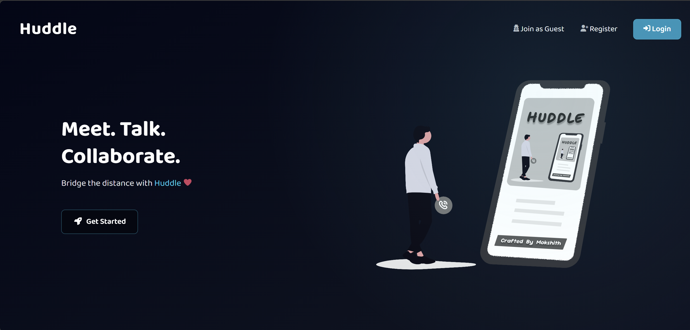
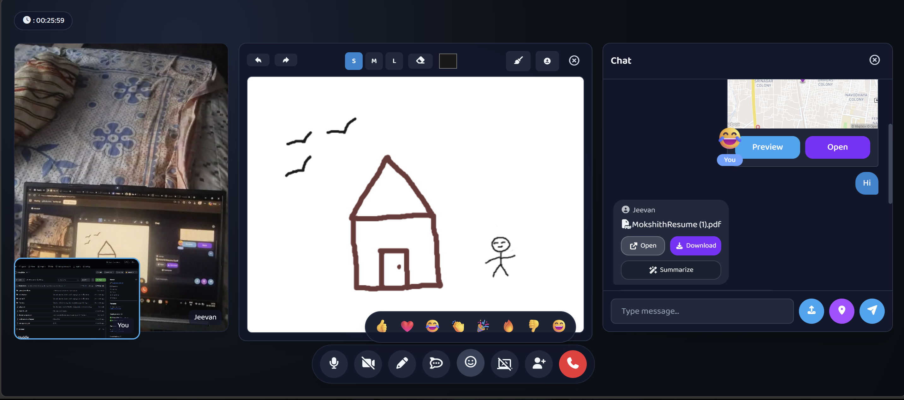

# Huddle

Huddle is a full-stack, real-time video conferencing app built on the MERN stack with Socket.io and WebRTC  think a lightweight Google Meet with a built-in collaborative whiteboard, live location sharing, and AI-powered document summaries in chat. 

## 🌐 Live Demo

**[huddlemeet.tech](https://huddlemeet.tech/)**



## ✨ Core Features


- **📹 Video & Audio Conferencing**: WebRTC-powered peer-to-peer real-time video and audio meetings, with a pre-join lobby to check camera/mic before entering.
- **🖥️ Screen Sharing**: Share your screen with other participants seamlessly mid-meeting.
- **🎨 Interactive Whiteboard**: Real-time collaborative whiteboard with draw, undo, redo, adjustable brush size, eraser, and clear (with confirmation) synchronized across all clients, including late joiners.
- **💬 Real-time Chat**: In-meeting text chat via Socket.io, with file/media sharing.
- **🤖 AI-Powered PDF Summaries**: Summarize shared PDF documents right in chat (Gemini API), with expandable/collapsible summary bubbles.
- **📍 Live Location Sharing**: Share your current location in-meeting with reverse geocoding (Mapbox) and an in-app preview.
- **🔗 Invite Tools**: Share a meeting link via copy, native share sheet, WhatsApp, or a scannable QR code.
- **😀 Reactions**: Floating emoji reactions tagged with the sender's name.
- **🕒 Meeting History**: Dashboard of past meetings, taggable for organization.
- **📁 Media Management**: Media uploads backed by Cloudinary/Multer, browsable per meeting.
- **⚡ Modern & Responsive UI**: Sleek, responsive frontend in React and Tailwind CSS.
- **🔐 Authentication**: JWT + bcrypt-based registration and login, with token-expiry checks and post-login redirect-back-to-intended-page support.


## 🚀 Tech Stack

**Frontend:** React 19 (Vite), Tailwind CSS, React Router, Socket.io Client, Axios, Mapbox GL.
**Backend:** Node.js, Express, MongoDB (Mongoose), Socket.io, JWT + bcrypt, Cloudinary + Multer, Joi, Google Gemini API, Jest.
**Infra & DevOps:** AWS EC2, Nginx, PM2, GitHub Actions CI/CD, self-hosted runner, and manual deployment approval.

## 🛠️ Installation & Setup

1. **Clone the repository**
   ```bash
   git clone https://github.com/Mokshith2c/huddle.git
   cd huddle

   ```
2. **Backend Setup**
   ```bash
   cd backend
   npm install
   cp .env.example .env

   ```
   Fill in `.env`  Mongo URI, JWT secret, Cloudinary credentials, and a `GEMINI_API_KEY` (needed for AI PDF summaries). See `.env.example` for the full list.

   Start the backend server:
   ```bash
   npm run dev

   ```
3. **Frontend Setup**
   ```bash
   cd frontend
   npm install

   ```
   Create a `.env` file in `frontend/` with your backend host/port/protocol and a `VITE_MAPBOX_TOKEN` (needed for live location sharing).

   Start the frontend development server:
   ```bash
   npm run dev

   ```
4. **Docker (alternative)**

   `docker-compose.yml` at the repo root spins up both services  backend on `:5000`, frontend on `:5173`:
   ```bash
   docker compose up --build

   ```

## 📜 Scripts

### Backend

- `npm run dev`: Starts the server in development mode using nodemon.
- `npm start`: Starts the server in production mode.
- `npm run prod`: Starts the server using PM2.

### Frontend

- `npm run dev`: Starts the Vite development server.
- `npm run build`: Builds the application for production.
- `npm run preview`: Previews the production build locally.
- `npm run lint`: Runs ESLint for code formatting and error checking.

## 🧪 Testing

- **Backend**: Jest + Supertest, covering the user controller (`backend/src/tests/controllers`). Run with `npm test` inside `backend/`.

## 🧩 Engineering Challenges & Decisions

#### WebRTC Negotiation & Race Conditions

Real-time peer-to-peer connections introduced several timing issues during renegotiation. For example, two peers could initiate an offer at nearly the same time, causing `setRemoteDescription()` to fail because the connection was no longer in the expected signaling state.

To handle this, Huddle checks the current `signalingState` before applying incoming offers and uses WebRTC rollback when necessary. ICE candidates are also queued per peer when they arrive before the remote description is ready, then flushed once the description has been applied.

#### Efficient Media Switching

Switching cameras, microphones, or starting screen sharing can trigger unnecessary WebRTC renegotiation if tracks are repeatedly added and removed.

Huddle uses `RTCRtpSender.replaceTrack()` whenever a matching sender already exists, allowing the media source to change without starting another offer/answer cycle. `addTrack()` is only used when a new track type actually needs to be introduced.

#### Real-Time State Without Database Overhead

Chat messages and whiteboard strokes can generate frequent real-time updates. Persisting every event directly to MongoDB would introduce unnecessary database operations and latency.

Instead, active room state such as chat history, whiteboard strokes, and room membership is maintained in server memory. This keeps real-time interactions lightweight while accepting that ephemeral room state is lost when the server restarts.

#### Unified Authentication

Both REST API requests and Socket.io connections need to verify that a user is authenticated.

Rather than maintaining separate authentication mechanisms, Huddle uses the same JWT issued during login for both Express middleware and the Socket.io handshake. This keeps authentication behavior consistent across HTTP and real-time connections.

#### Why a P2P Mesh Architecture?

Huddle uses WebRTC peer-to-peer connections rather than routing media through the backend. Socket.io is used only for signaling and real-time application events; the actual audio/video streams flow directly between peers.

This reduces server bandwidth and media-processing requirements, making the architecture simpler and cheaper to operate. The tradeoff is that bandwidth and connection overhead increase as the number of participants grows.
## 🏗️ Architecture

Huddle uses WebRTC for peer-to-peer media and Socket.io as the signaling and real-time synchronization layer.

- **WebRTC** handles peer-to-peer audio/video streams.
- **Socket.io** handles signaling, room membership, chat, reactions, and whiteboard synchronization.
- **Express + Node.js** provides the REST API and Socket.io server.
- **MongoDB** stores persistent application data such as users and meeting history.
- **Cloudinary** stores uploaded media.
- **Gemini API** powers PDF summarization.
- **Mapbox** handles location reverse geocoding and map previews.
- **Nginx + PM2** serve the production frontend and backend on AWS EC2.

## 🔄 CI/CD

GitHub Actions workflows live in [`.github/workflows/`](https://claude.ai/chat/.github/workflows):

| Workflow Trigger What it does  |                                         |                                                                                                |
| ------------------------------ | --------------------------------------- | ---------------------------------------------------------------------------------------------- |
| `backend-test.yml`             | Push/PR to `main`                       | Runs the Jest test suite on Node 22 (`ubuntu-latest` runner)                                   |
| `deploy-backend.yml`           | Push to `devops` touching `backend/**`  | Pulls latest code on the EC2 host, runs `npm ci`, restarts the backend via PM2                 |
| `deploy-frontend.yml`          | Push to `devops` touching `frontend/**` | Pulls latest code on the EC2 host, builds the Vite app, copies `dist/` into the Nginx web root |

Both deploy workflows run on a **self-hosted GitHub Actions runner on the AWS EC2 instance** (`runs-on: [self-hosted, huddle]`) rather than GitHub-hosted runners  the job executes directly on the server, pulling `origin/devops`, rebuilding, and restarting the relevant process in place. There's no separate staging environment; `devops` is the deploy branch. Both jobs target an `ec2-production` GitHub Environment with a required reviewer, so a push to `devops` pauses at "Waiting for review" in the Actions tab until manually approved  the code doesn't reach EC2 until then.